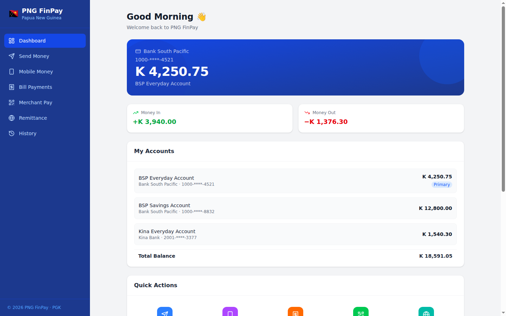
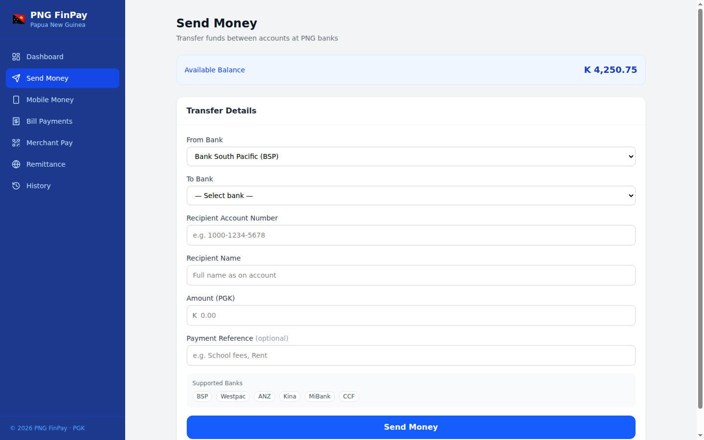
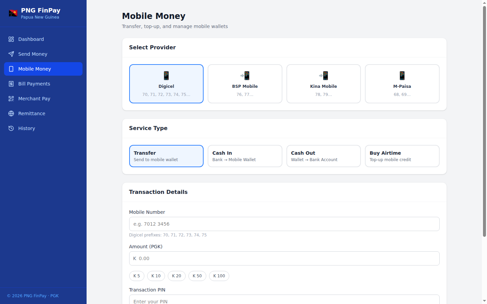
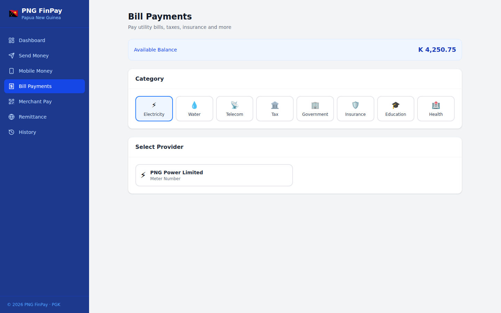
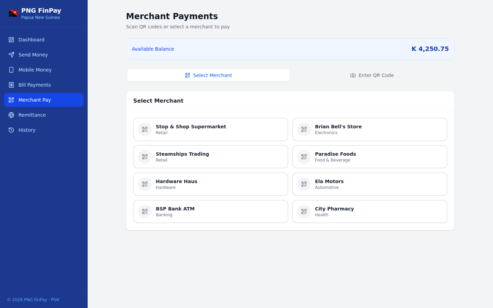
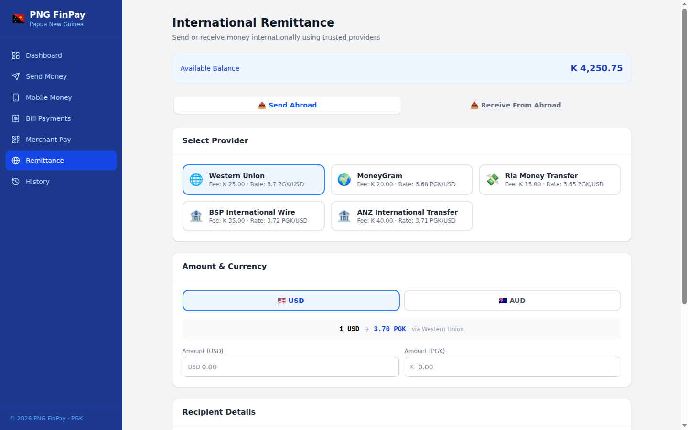
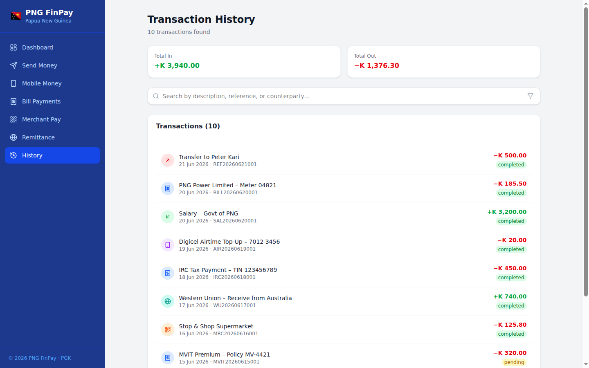

# PNG FinPay

A unified fintech interface for Papua New Guinea covering all major payment channels — built with React 18, TypeScript, Vite, and Tailwind CSS.

## Screens

### Dashboard


### Send Money


### Mobile Money


### Bill Payments


### Merchant Payments


### International Remittance


### Transaction History


## Features

| Module | Details |
|---|---|
| **Send Money** | Bank-to-bank transfers across BSP, Westpac, ANZ, Kina Bank, MiBank, CCF |
| **Mobile Money** | Transfer, Cash In/Out, Airtime top-up via Digicel, BSP Mobile, Kina Mobile, M-Paisa |
| **Bill Payments** | 15 providers — electricity (PNG Power), water, telecom, tax (IRC), government, insurance, education, health |
| **Merchant Pay** | QR payments at 8 PNG merchants or manual QR code entry |
| **Remittance** | Send/receive internationally via Western Union, MoneyGram, Ria, BSP SWIFT, ANZ Wire with live PGK rates |
| **History** | Searchable, filterable transaction log with type and status filters |

## Getting Started

```bash
npm install
npm run dev
```

Open [http://localhost:5173](http://localhost:5173).
